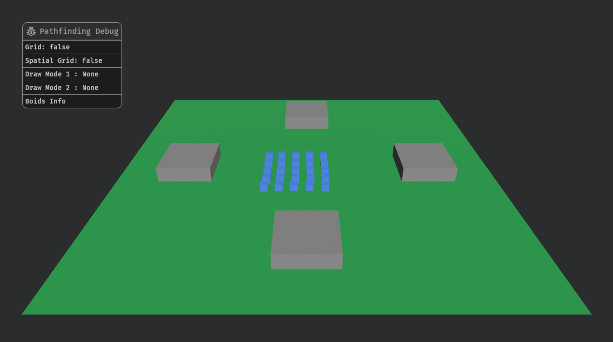

# Bevy Pathfinding

A simple 3D Bevy plugin that combines **flowfield pathfinding** with **boid-based collision avoidance** to move units smoothly.


### What is **Flowfield Pathfinding**?

A grid-based navigation technique that first calculates the minimum “cost” from every cell to a target, then turns those costs into a field of simple direction vectors. Units just sample the vector under their feet each step to follow an optimal path with almost no per-unit computation

### Okay, but what the heck is **Boid Collision Avoidance**?

A lightweight, local steering technique where each unit blends three factors—steering away from too-close neighbors (separation), matching their heading (alignment), and moving toward the group’s center (cohesion)—to naturally avoid collisions and maintain smooth, flock-like motion.


## Getting Started

Add the **bevy_pathfinding** crate:

```
cargo add bevy_pathfinding
```

See the [example](examples/basic.rs) for full setup instructions.

## Examples

- basic

```
cargo run --example <example name>
```

or to run with the debug UI: 

```
cargo run --example basic --features bevy_pathfinding/debug
```

## Using the Debug Settings


What do all of these settings do?

- Grid -> Draw the map grid
- Spatial Grid -> Draw the spatial partitioning grid
- Draw Mode 1 -> Draw the flowfield/costfield/inegration field/cell indexes
- Draw Mode 2 -> Draw the flowfield/costfield/inegration field/cell indexes (secondary slot)
- Boids Info: 
    - Radius -> Draw boid radius
    - Separation -> separation weight (how strongly it steers away)
    - Cohesion -> cohesion weight (how strongly it steers inward)
    - Alignment ->  alignment weight (how strongly it matches neighbor heading)
    - Radius -> how far each boid “sees” before applying above factors



## Bevy Version Compatbility

| bevy | bevy_pathfinding |
| ---- | ---------------- |
| 0.16 | 0.1.0            |

Refer to the [Changelog](Changelog.md) to view breaking changes and updates.

## Migration Guies

None yet

## License 

- MIT License (LICENSE-MIT or http://opensource.org/licenses/MIT)
- Apache License, Version 2.0 (LICENSE-APACHE or http://www.apache.org/licenses/LICENSE-2.0)